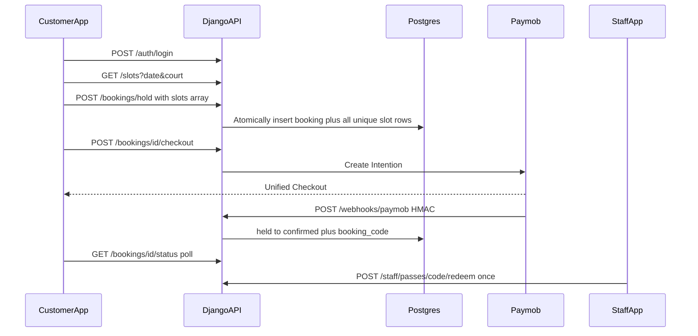

# Mahgooz MVP v1 — Django REST Backend

## What I recommend (and why)

The Core MVP in [backend/requirements.md](backend/requirements.md) is the right product scope, but it **must** be wrapped in the challenge’s global rules: real Paymob checkout, HMAC-verified callback as the only “paid” signal, and a public URL for webhooks. The UI spec in [docs/pages-and-ui-design.md](docs/pages-and-ui-design.md) already has the correct mechanic (`hold → pay → webhook → pass → redeem once`). Use that as the API contract.

**Keep in v1**

- Phone + password JWT auth (your choice) so every paid booking has a `user_id`
- Two seeded courts, 60-minute slots, 14-day book-ahead window, hours 08:00–22:00
- **Hold TTL 10 minutes** so abandoned/failed payments release the slot
- One booking can contain **one or more 60-minute slots**; the MVP accepts multiple distinct start times for the same court and date
- **Postgres partial unique index** on each active `BookingSlot`'s `court + date + start_time`
- Real Paymob Intention API + Unified Checkout + HMAC webhook
- Attendee **names** (from requirements.md), not just a player count
- Morning / afternoon / evening price bands as **config**, not a pricing engine
- Staff 4-digit PIN from env (not a full admin user system)
- Public pass by short code (`MGZ-7F42K`); frontend renders the QR from that code

**Cut from v1** (explicitly out of scope)

- SMS OTP, refunds, WhatsApp/email, dynamic pricing, multi-venue, camera scanner API, Celery, Redis
- Transaction Inquiry as a required path (webhook is source of truth). Add a small reconcile helper only if time remains.



---

## Stack

| Piece | Choice |
|-------|--------|
| Runtime | Python 3.12, Django 5.x, DRF |
| Auth | `djangorestframework-simplejwt` (customer) + staff PIN → staff JWT |
| DB | PostgreSQL (your choice) |
| Payments | Paymob Intention API, Egypt, cards in test mode |
| Config | `django-environ` / `.env` — never commit secrets |
| Tunnel | ngrok (or Cloudflare Tunnel) for `notification_url` |

Project layout under [backend/](backend/):

```
backend/
  manage.py
  config/                 # settings, urls, wsgi
  accounts/               # User (phone unique), register/login/me
  bookings/               # Court, Booking, slots, hold, redeem
  payments/               # Paymob client, HMAC, webhook
  postman/                # collection + environment
  requirements.txt
  .env.example
```

---

## Data model (minimum that actually works)

**User** (custom user, phone as username)

- `phone` unique, normalized `01xxxxxxxxx`
- `name`, hashed password
- `email` nullable, unused in v1

**Court** (seeded: Court 1, Court 2)

**Booking** — one customer hold/payment/pass that groups one or more slots

- `id` UUID
- `user` FK
- `status`: `held` → `pending_payment` → `confirmed` | `failed` | `cancelled` | `expired` → `redeemed`
- `booker_name` (copied from user at hold)
- `attendee_names` JSON list of strings (required, 1–4)
- `total_price_egp`, `total_price_cents` (sum of the selected slots; piasters for Paymob)
- `hold_expires_at`
- `booking_code` unique, nullable until paid (`MGZ-XXXXX`)
- `paymob_intention_id`, `paymob_transaction_id` unique nullable
- `redeemed_at`

**BookingSlot** — one 60-minute court/time allocation belonging to a booking

- `id` UUID
- `booking` FK with related name `slots`
- `court` FK
- `date`, `start_time`
- `price_egp`, `price_cents` captured at hold time
- `released_at` nullable; null means this row still occupies the court/time slot

**Partial unique index** on `BookingSlot` (this is the per-slot double-booking guarantee):

```python
UniqueConstraint(
    fields=["court", "date", "start_time"],
    condition=Q(released_at__isnull=True),
    name="uniq_active_court_slot",
)
```

Confirmed and redeemed slot rows keep `released_at=NULL` and remain occupied. Expired, failed, and cancelled bookings set `released_at` on every child slot so all of them become available together.

**Multi-slot invariant:** the hold payload contains a non-empty `slots` array. For MVP, every entry must have the same `court_id` and `date`, with distinct `start_time` values; this supports consecutive or non-consecutive hours on one court while keeping one coherent payment and pass. Reject mixed courts/dates or duplicate entries with `400`.

**Atomic hold:** inside one `transaction.atomic()` block, expire stale holds, validate every requested slot, create the parent `Booking`, and insert every `BookingSlot`. The partial unique constraint is the final concurrency guard. If any requested slot conflicts, roll back the entire booking—never leave a partial hold—and return `409` with `conflicting_slots`.

**Hold expiry:** lazy on `GET /slots` and `POST /hold`; atomically set expired parents to `expired` and release all their child slot rows. Also add a `python manage.py expire_holds` command for demo safety. No Redis.

**Atomic redeem:** `UPDATE … WHERE booking_code=%s AND status='confirmed'` — if `rowcount != 1`, return already redeemed / invalid.

**Pricing (settings, not a table):**

- Morning 08:00–12:00 → EGP 200
- Afternoon 12:00–17:00 → EGP 280
- Evening 17:00–22:00 → EGP 350

Slot list includes `period`, `price_egp`, `label` (`Morning available` for morning) so the frontend can highlight underused hours without extra APIs.

---

## API surface (all in Postman)

Prefix: `/api/v1`. JSON only. CORS enabled for the frontend origin.

### Public

- `GET /health` — liveness for tunnel/deploy
- `GET /courts` — two courts
- `GET /slots?date=YYYY-MM-DD&court_id=` — generated 08:00–21:00 grid with `available | held | booked` (never expose another user’s hold as bookable)
- `GET /passes/{code}` — public pass after paid (no phone, no Paymob ids)

### Customer auth

- `POST /auth/register` — name, phone, password
- `POST /auth/login` — phone, password → access + refresh
- `POST /auth/refresh`
- `GET /auth/me`

### Booking (JWT)

- `POST /bookings/hold` — `slots[]`, `attendee_names` → one booking holding all requested slots, or **409 with no partial hold**
- `DELETE /bookings/{id}` — cancel own hold / unpaid booking and release all its slots
- `POST /bookings/{id}/checkout` — create one Paymob intention for `total_price_cents`, with one item per slot, and return `checkout_url` (`unifiedcheckout/?publicKey&clientSecret`)
- `GET /bookings/{id}/status` — poll for pending page (`held` / `pending_payment` / `confirmed` / `failed` / `expired`)
- `GET /bookings` — my bookings (upcoming / past derived by date+status)
- `GET /bookings/{id}` — owner detail including code after confirmed

Multi-slot hold request:

```json
{
  "slots": [
    { "court_id": "<court-uuid>", "date": "2026-08-20", "start_time": "18:00" },
    { "court_id": "<court-uuid>", "date": "2026-08-20", "start_time": "19:00" }
  ],
  "attendee_names": ["Ahmed Hassan", "Omar Ali"]
}
```

Success (`201`) returns the parent `booking_id`, normalized `slots`, `hold_expires_at`, and `total_price_cents`. A conflict returns `409 SLOT_TAKEN` with every currently conflicting requested slot; the response must make clear that **none** of the requested slots were held.

### Staff (staff JWT from PIN)

- `POST /staff/login` `{ "pin": "...." }`
- `GET /staff/bookings?date=today` — next ~12 hours, paid only
- `GET /staff/passes/{code}` — full detail for check-in
- `POST /staff/passes/{code}/redeem` — once; second call **409 already redeemed**

### System

- `POST /webhooks/paymob` — **no JWT**; HMAC-verify first; ignore forgeries with 401; on success set `confirmed` + issue `booking_code`; on failure set `failed` and free the slot
- Redirect URL is **frontend** `/book/pending?booking_id=…`, not this API — browser success page is never treated as paid

Standard error body for all failures:

```json
{ "error": { "code": "SLOT_TAKEN", "message": "This slot was just booked. Please choose another." } }
```

---

## Paymob (required, not mocked)

Follow the project skill: Intention API from the backend only; `special_reference` = parent booking UUID; `notification_url` = public `POST /api/v1/webhooks/paymob`; amount is `Booking.total_price_cents` in piasters. Send one Paymob item per `BookingSlot`, and verify the locally calculated total before creating the intention.

Env (in `.env.example` only):

- `PAYMOB_SECRET_KEY`, `PAYMOB_PUBLIC_KEY`, `PAYMOB_HMAC_SECRET`, `PAYMOB_INTEGRATION_ID_CARD`
- `PAYMOB_BASE_URL=https://accept.paymob.com`
- `FRONTEND_URL`, `PUBLIC_API_URL` (ngrok)
- `STAFF_PIN`

Implementation notes:

- HMAC SHA-512 with Paymob’s documented field order **before** any status write
- Unique `paymob_transaction_id` so duplicate callbacks are idempotent
- Checkout does not mark paid; only the verified webhook does
- If Paymob create-intention fails, keep the booking and all its slots `held` (user can retry) until TTL
- A verified successful webhook confirms the parent booking and therefore all child slots as one unit; a verified failure releases all child slots as one unit

---

## Auth and permissions

- Customer JWT on hold / checkout / my bookings
- Staff JWT on lookup / redeem / today’s list
- Webhook unsigned by JWT, authenticated by HMAC
- Pass GET is public (unlisted code)
- Staff cannot redeem `pending_payment` or wrong-day passes (return clear error codes)

---

## Tests (small, high-value)

Django tests, not a large suite:

1. Multi-slot hold succeeds and returns every normalized slot plus the summed price
2. Duplicate or mixed-court/date slots in one request → 400 and creates nothing
3. If one slot in a multi-slot request is taken → 409, identifies the conflict, and holds none of the other requested slots
4. Two concurrent overlapping multi-slot holds → only one request can hold the shared slot; the losing request creates no partial hold
5. Forged webhook (bad HMAC) → booking stays unpaid and every slot remains held
6. Valid success webhook → parent booking `confirmed` + one code issued for all slots
7. Failed webhook → every slot in the booking becomes available again
8. Expired or cancelled hold → every slot in the booking becomes available again
9. Redeem twice → first 200, second 409

---

## Postman collection (explicit deliverable)

Files:

- [backend/postman/Mahgooz_API.postman_collection.json](backend/postman/Mahgooz_API.postman_collection.json)
- [backend/postman/Mahgooz_Local.postman_environment.json](backend/postman/Mahgooz_Local.postman_environment.json)

Collection v2.1, folders matching the API groups above. Collection variables: `base_url`, `access_token`, `refresh_token`, `staff_token`, `court_id`, `booking_id`, `booking_code`.

**Every request includes saved examples:**

- Success (2xx) with realistic JSON
- At least one failure (400 duplicate/mixed slot validation, 401 unauthenticated, 403 staff-only, 404 unknown code, 409 slot taken / already redeemed, 401 bad HMAC)

Login/hold/checkout requests use test scripts to stash tokens and ids into collection variables so the folder can be run top-to-bottom.

Webhook example includes a documented HMAC-invalid body (will 401) and a note that a valid HMAC body must be generated against `PAYMOB_HMAC_SECRET` (cannot be a static “success” example without the secret).

---

## Implementation order

1. Django project + Postgres + custom User + JWT
2. Court seed + Booking/BookingSlot models + partial unique index
3. Slots + atomic multi-slot hold/cancel + lazy expiry
4. Paymob client + checkout + HMAC webhook
5. Pass + my bookings + staff PIN/login/lookup/redeem
6. Tests for constraint / HMAC / redeem
7. Postman collection + `.env.example` + short `backend/README.md` (run, migrate, ngrok, register webhook)

No frontend work in this pass.
