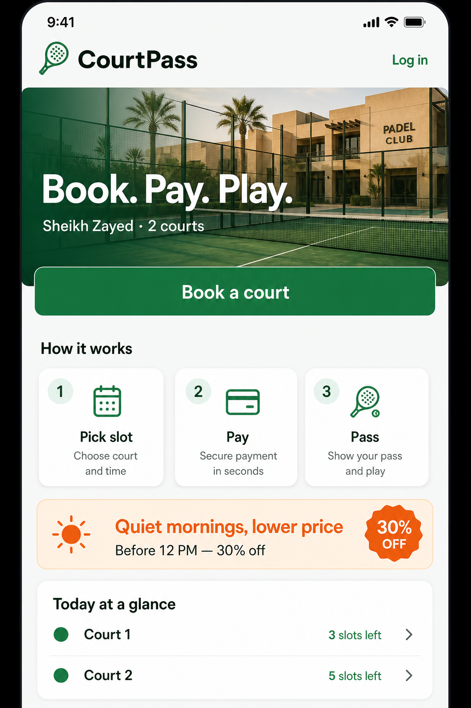
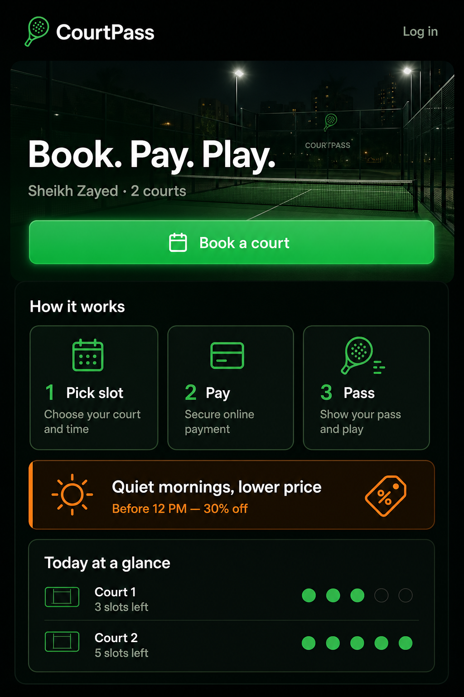

# Mahgouz — Brand & Visual Identity

> Single source of truth for colors, typography, logo usage, UI tokens, and tone.  
> Product: padel court booking · Sheikh Zayed · **Pay → Reserve → Redeem**

---

## 1. Brand essence

| Attribute | Direction |
|-----------|-----------|
| **Name** | **Mahgouz** — محجوز, “booked / reserved.” The court is yours. |
| **Personality** | Fast, social, outdoor, trustworthy |
| **Feels like** | A local padel club app — not a generic gym or fintech |
| **Audience** | Players in Sheikh Zayed who today book via WhatsApp |
| **Promise** | Book a court in under a minute, pay upfront, show up with a pass |
| **Tagline** | **Book. Pay. Play.** |

---

## 2. Logo & wordmark

### Wordmark

**Mahgouz** — one word. Title case in UI and marketing. Never all-caps (`MAHGOUZ`), never split (`Mah Gouz`), never the old placeholder **CourtPass**.

| Usage | Spec |
|-------|------|
| Primary lockup | Padel racket icon (minimal line) + **Mahgouz** |
| Icon color (light) | `#1B7A4E` on `bg` / `surface` |
| Icon color (dark) | `#1B7A4E` on header, or `#F4F7F5` on hero scrim |
| Wordmark on hero | `#F4F7F5` (both modes — photo + scrim behind) |
| Wordmark font | **DM Sans Bold (700)** |
| Letter-spacing | Default (no wide tracking) |

### Icon concept

Simple **line-style padel racket** — oval head, short handle, no fill. Matches Lucide icon weight (1.5–2px stroke). Avoid tennis racket shapes (padel head is solid/no strings pattern in mark — use a filled oval or mesh dots sparingly).

### Clear space

Minimum padding around logo = height of the racket icon on all sides.

### Files (source of truth for the mark)

| Asset | Path |
|-------|------|
| App icon (green) | [assets/brand/mahgouz-icon-green-official.png](./assets/brand/mahgouz-icon-green-official.png) |
| App icon (dark) | [assets/brand/mahgouz-icon-dark-official.png](./assets/brand/mahgouz-icon-dark-official.png) |
| Lockup (light) | [assets/brand/mahgouz-lockup-light-official.png](./assets/brand/mahgouz-lockup-light-official.png) |
| Lockup (dark) | [assets/brand/mahgouz-lockup-dark-official.png](./assets/brand/mahgouz-lockup-dark-official.png) |
| Brand board | [assets/brand/mahgouz-brand-board-official.png](./assets/brand/mahgouz-brand-board-official.png) |

Editable Canva kit lives in the **Mahgouz Brand** folder (app icons, lockups, brand board, 7-page brand kit).

### Don’t

- Stretch or rotate the mark
- Use gradients on the wordmark text
- Place green wordmark on busy photo without scrim
- Use a tennis-racket string pattern — padel head is a solid oval with sparse mesh dots

---

## 3. Color system

Padel = **court green** + **clay orange**. Light and dark mode share the **same brand accents** — only backgrounds, surfaces, and text invert. Never swap to a different green or orange in dark mode.

### Brand accents (both modes — do not change)

| Token | Hex | Role |
|-------|-----|------|
| `court-green` | `#1B7A4E` | Primary CTA, links, active slot, logo icon |
| `court-green-dark` | `#145C3A` | Hover, pressed, header on scroll |
| `court-green-light` | `#D4EDDF` | Available-slot chip (light), badge bg (light) |
| `clay-orange` | `#E86A2A` | Morning deals, promo text, accent badges |
| `clay-orange-light` | `#FDE8DC` | Promo banner bg (light only) |
| `error` | `#C0392B` | Failed payment, expired pass |
| `redeemed` | `#6B7280` | Checked-in / past state |

### Semantic tokens (light ↔ dark)

| Token | Light | Dark | Notes |
|-------|-------|------|-------|
| `bg` | `#F4F7F5` | `#0F1A14` | Page background — dark uses ink hue, not pure black |
| `surface` | `#FFFFFF` | `#1A2620` | Cards, inputs, modals |
| `surface-elevated` | `#FFFFFF` | `#223029` | Bottom sheets, dropdowns |
| `border` | `#E2E8E4` | `#2D4035` | Dividers, card outlines |
| `text-primary` | `#0F1A14` | `#F4F7F5` | Headlines, prices, body |
| `text-muted` | `#5C6B62` | `#8FA396` | Secondary copy |
| `slot-available-bg` | `#D4EDDF` | `rgba(27,122,78,0.18)` | Same green, tinted |
| `slot-held-bg` | `#FFF3CD` | `rgba(133,100,4,0.22)` | Warning tint |
| `slot-held-text` | `#856404` | `#D4A843` | Held label |
| `slot-booked-bg` | `#E8EAEC` | `#1E2A24` | Unavailable |
| `promo-banner-bg` | `#FDE8DC` | `rgba(232,106,42,0.12)` | Same orange, low opacity on dark |

### Dark-mode-only enhancement (optional)

One allowed difference: a **subtle green glow** on the primary CTA so it reads on dark surfaces. Same button color — no brighter green.

```css
/* dark mode only — primary button */
box-shadow: 0 0 24px rgba(27, 122, 78, 0.15);
```

Do **not** use neon greens, gradient buttons, or heavy bloom elsewhere. Cards, chips, and badges stay flat like light mode.

### Gradients

| Name | Light | Dark |
|------|-------|------|
| Hero scrim | `linear-gradient(180deg, rgba(15,26,20,0.05) 0%, rgba(15,26,20,0.55) 100%)` | `linear-gradient(180deg, rgba(15,26,20,0.35) 0%, rgba(15,26,20,0.82) 100%)` |
| CTA hover | `#1B7A4E` → `#145C3A` | Same |

Use the **same hero photo** in both modes; dark mode relies on a stronger scrim, not a different image.

### Contrast

- Primary button: `#1B7A4E` bg + `#FFFFFF` text in **both** modes
- Orange promo text: `#E86A2A` in **both** modes
- Slot selected: `#1B7A4E` fill + white text in **both** modes

---

## 4. Typography

Load from [Google Fonts](https://fonts.google.com):

```html
<link href="https://fonts.googleapis.com/css2?family=DM+Sans:wght@600;700&family=Inter:wght@400;500;600&family=JetBrains+Mono:wght@500&display=swap" rel="stylesheet">
```

### Scale (mobile-first)

| Token | Font | Size | Weight | Line height | Use |
|-------|------|------|--------|-------------|-----|
| `display` | DM Sans | 32px | 700 | 1.15 | Hero headline |
| `h1` | DM Sans | 24px | 700 | 1.2 | Page titles |
| `h2` | DM Sans | 20px | 600 | 1.25 | Section headers |
| `h3` | DM Sans | 17px | 600 | 1.3 | Card titles |
| `body` | Inter | 16px | 400 | 1.5 | Paragraphs, labels |
| `body-sm` | Inter | 14px | 400 | 1.45 | Captions, helper text |
| `label` | Inter | 14px | 500 | 1.2 | Form labels, badges |
| `button` | Inter | 16px | 600 | 1 | Button text |
| `pass-code` | JetBrains Mono | 28px | 500 | 1.2 | Booking pass code |

### Rules

- Headlines: **DM Sans** only
- UI chrome (buttons, inputs, nav): **Inter**
- Never use more than two font families on one screen
- Prices: `text-primary` + tabular nums; suffix `EGP` in `body-sm` muted

---

## 5. Spacing & layout

| Token | Value | Use |
|-------|-------|-----|
| `space-xs` | 4px | Icon gaps |
| `space-sm` | 8px | Tight stacks |
| `space-md` | 16px | Card padding, screen gutters |
| `space-lg` | 24px | Section gaps |
| `space-xl` | 32px | Hero padding |
| `max-width` | 480px | Mobile shell centered on desktop |
| `radius-sm` | 8px | Chips, small buttons |
| `radius-md` | 12px | Cards, inputs |
| `radius-lg` | 16px | Hero card, bottom sheets |
| `radius-full` | 9999px | Pills, avatar |

### Touch targets

Minimum **44×44px** for all interactive elements (slots, CTAs, nav).

---

## 6. Components (visual spec)

Same structure in light and dark — swap surface/text tokens from [Semantic tokens](#semantic-tokens-light--dark). Brand colors stay fixed.

### Primary button (both modes)

| Property | Value |
|----------|-------|
| Background | `#1B7A4E` |
| Text | `#FFFFFF`, Inter 600, 16px |
| Padding | 14px 24px |
| Radius | 12px |
| Hover | `#145C3A` |
| Dark-only | optional glow: `0 0 24px rgba(27,122,78,0.15)` |
| Width | Full-width on mobile CTAs |

Labels: "Book a court" · "Pay with Paymob" · "Log in"

### Secondary button

| | Light | Dark |
|---|-------|------|
| Background | `#FFFFFF` | `#1A2620` |
| Border | `1px #E2E8E4` | `1px #2D4035` |
| Text | `#1B7A4E` | `#1B7A4E` |

### Promo banner (morning deal)

| | Light | Dark |
|---|-------|------|
| Background | `#FDE8DC` | `rgba(232,106,42,0.12)` on `surface` |
| Headline | `#0F1A14` | `#F4F7F5` |
| Accent / sub | `#E86A2A` | `#E86A2A` |

Copy: "Quiet mornings, lower price" · "Before 12 PM — 30% off"

### Cards

| | Light | Dark |
|---|-------|------|
| Background | `#FFFFFF` | `#1A2620` |
| Border | `1px #E2E8E4` | `1px #2D4035` |
| Radius | 12px | 12px |
| Padding | 16px | 16px |
| Shadow | `0 1px 3px rgba(15,26,20,0.06)` | none (border carries depth) |

### Slot chip

| State | Background (L / D) | Border | Text (L / D) |
|-------|----------------------|--------|--------------|
| Available | `#D4EDDF` / `rgba(27,122,78,0.18)` | `#1B7A4E` | `#0F1A14` / `#F4F7F5` |
| Selected | `#1B7A4E` / `#1B7A4E` | — | `#FFFFFF` |
| Held | `#FFF3CD` / `rgba(133,100,4,0.22)` | — | `#856404` / `#D4A843` |
| Booked | `#E8EAEC` / `#1E2A24` | — | `#5C6B62` / `#8FA396` |

### Status badges

| Status | Background (L / D) | Text |
|--------|-------------------|------|
| Ready to play | `#D4EDDF` / `rgba(27,122,78,0.18)` | `#145C3A` / `#1B7A4E` |
| Checked in | `#E8EAEC` / `#1E2A24` | `#6B7280` |
| Morning deal | `#FDE8DC` / `rgba(232,106,42,0.12)` | `#E86A2A` |

---

## 7. Iconography & imagery

| Asset | Direction |
|-------|-----------|
| **Icons** | Lucide React — 20–24px, stroke 1.5–2, color `text-muted` or `court-green` |
| **Hero photos** | Real padel courts, golden hour or daytime, Sheikh Zayed / Egypt vibe |
| **Photo treatment** | Green scrim gradient; never raw unmasked photo behind white text |
| **Illustrations** | Avoid — photography + UI cards only for MVP |
| **Court labels** | Always **Court 1** / **Court 2** |

### Photography mood

- Active but not stock-heavy
- Blue padel courts, glass walls, players optional (blurred ok)
- Warm, inviting — matches morning/evening slot story

---

## 8. Voice & copy

| Do | Don't |
|----|-------|
| "Book a court" | "Initiate reservation" |
| "Ready to play" | "Transaction successful" |
| "Quiet mornings, lower price" | "Dynamic pricing module enabled" |
| "Show this to staff on arrival" | "Present QR to authentication terminal" |
| Short Egyptian-friendly English | Jargon, passive voice |

**Microcopy tone:** confident, local, helpful — like Mostafa texting a regular, but cleaner.

---

## 9. Tailwind CSS tokens

Drop into `tailwind.config.js` or `@theme` (v4):

```js
// Brand accents — never override in dark:
colors: {
  court: {
    green: '#1B7A4E',
    'green-dark': '#145C3A',
    'green-light': '#D4EDDF',
  },
  clay: {
    orange: '#E86A2A',
    'orange-light': '#FDE8DC',
  },
},
// Semantic — use with dark: prefix on bg, surface, text, border:
// bg:        #F4F7F5  →  dark:bg-[#0F1A14]
// surface:   #FFFFFF  →  dark:bg-[#1A2620]
// border:    #E2E8E4  →  dark:border-[#2D4035]
// ink:       #0F1A14  →  dark:text-[#F4F7F5]
// muted:     #5C6B62  →  dark:text-[#8FA396]
// CTA stays: bg-court-green hover:bg-court-green-dark
// Optional:  dark:shadow-[0_0_24px_rgba(27,122,78,0.15)] on primary button only
fontFamily: {
  display: ['"DM Sans"', 'system-ui', 'sans-serif'],
  sans: ['Inter', 'system-ui', 'sans-serif'],
  mono: ['"JetBrains Mono"', 'monospace'],
},
borderRadius: {
  card: '12px',
},
```

---

## 10. Landing page reference

### Light mode



### Dark mode



Dark mode inverts surfaces (`#0F1A14` bg, `#1A2620` cards) but keeps the **same** green CTA `#1B7A4E` and orange accent `#E86A2A`. Optional subtle glow on the primary button only — see [Dark-mode-only enhancement](#dark-mode-only-enhancement-optional).

> **Note on mockup:** Layout and tokens are the source of truth. Generated mockup images may still show the old **CourtPass** wordmark — ship **Mahgouz** + the racket lockup from [Brand assets](#files-source-of-truth-for-the-mark). Dark mockups may look slightly glowy; treat [Semantic tokens](#semantic-tokens-light--dark) as source of truth when building UI.

### Section breakdown (matches mockup)

1. **Header** — Logo + Log in  
2. **Hero** — Court photo, scrim, "Book. Pay. Play.", location line  
3. **Primary CTA** — Full-width green button  
4. **How it works** — 3 steps in white cards  
5. **Morning promo** — Orange-tinted banner  
6. **Availability teaser** — Today's slot counts per court  

Full interaction spec: [pages-and-ui-design.md](./pages-and-ui-design.md#51-landing--)

---

## 11. Theme implementation

| Decision | Choice |
|----------|--------|
| Strategy | `prefers-color-scheme` default + optional header toggle |
| Tailwind | `darkMode: 'class'` on `<html>` — toggle adds/removes `dark` |
| Scope | Customer app (landing, book, bookings, pass) — staff pages may stay light for MVP |
| shadcn | Use CSS variables mapped to semantic tokens above |

```tsx
// AppShell — respect system preference, allow override
<html className={theme}> {/* '' | 'dark' */}
  <body className="bg-[#F4F7F5] text-[#0F1A14] dark:bg-[#0F1A14] dark:text-[#F4F7F5]">
```

**Consistency rule:** If a component looks different between modes beyond bg/text swap, it's wrong — except the one optional CTA glow in dark.

---

## 12. Brand checklist (before shipping UI)

- [ ] DM Sans + Inter loaded  
- [ ] Light bg `#F4F7F5`, dark bg `#0F1A14` — not pure `#000`  
- [ ] Primary CTA `#1B7A4E` in **both** modes (no alternate green)  
- [ ] Clay orange `#E86A2A` in **both** modes (no alternate orange)  
- [ ] Hero uses same photo + scrim (stronger scrim in dark only)  
- [ ] Dark CTA glow is subtle and primary-button-only  
- [ ] Touch targets ≥ 44px  
- [ ] Wordmark reads **Mahgouz** consistently (never CourtPass)  

---

*Mahgouz · Brand v1.2 (name + lockup)*
