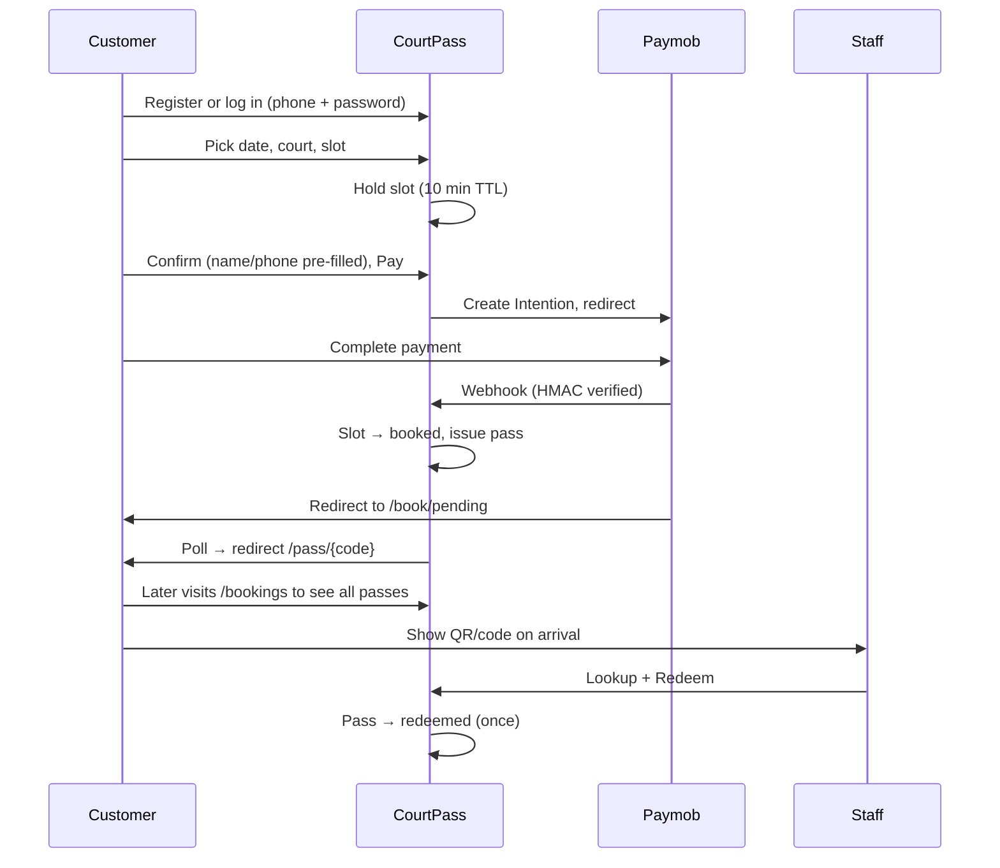
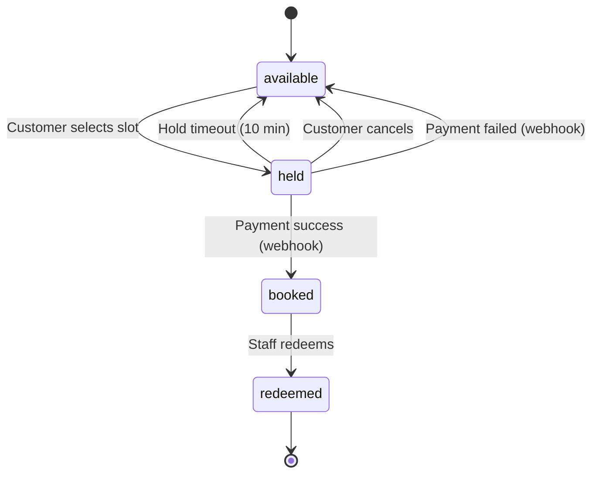

# CourtPass — Pages & UI Design Spec

> **Product:** Reserve & Redeem padel court booking for Mostafa's two courts in Sheikh Zayed  
> **Stack (later):** Laravel + Inertia + React  
> **Scope of this doc:** Pages, UI, flows, branding — no backend implementation yet  
> **Core mechanic:** Pay → Reserve → Redeem

---

## 1. Product summary

| Item | Value |
|------|-------|
| Working name | **CourtPass** (placeholder — swap for final brand) |
| Courts | 2 padel courts |
| Location | Sheikh Zayed, Egypt |
| Owner persona | Mostafa — runs bookings manually on WhatsApp today |
| Customer flow | Log in → Pick slot → Pay (Paymob) → Get pass → View in `/bookings` |
| Staff flow | Look up pass → Verify paid → Redeem once |
| Customer auth | **Yes — simple phone + password login** (Laravel Breeze) |

### Problems this UI solves

| Problem | UI answer |
|---------|-----------|
| WhatsApp booking chaos | Self-serve booking in 3 taps |
| No-shows | Pay upfront before slot is confirmed |
| Double booking | Slot locked on selection; released on timeout or failed payment |
| Unknown attendees | Pass shows account name + headcount |
| Staff can't verify | Staff lookup + one-tap redeem |
| Morning underuse | Landing page promotes morning slots with lower price |
| No booking history | `/bookings` lists upcoming + past passes for logged-in user |

---

## 2. Brand & visual system

> **Full spec:** [branding.md](./branding.md) — colors, components, mockups, Tailwind tokens.  
> **Rule:** Light and dark share the same brand green `#1B7A4E` and clay orange `#E86A2A`. Only surfaces and text invert.

Padel = fast, social, outdoor energy. Keep it clean and sporty — not a generic gym app.

### Color palette (semantic)

| Token | Light | Dark |
|-------|-------|------|
| `--bg` | `#F4F7F5` | `#0F1A14` |
| `--surface` | `#FFFFFF` | `#1A2620` |
| `--border` | `#E2E8E4` | `#2D4035` |
| `--text-primary` | `#0F1A14` | `#F4F7F5` |
| `--text-muted` | `#5C6B62` | `#8FA396` |
| `--court-green` | `#1B7A4E` | `#1B7A4E` ← same |
| `--court-green-dark` | `#145C3A` | `#145C3A` ← same |
| `--clay-orange` | `#E86A2A` | `#E86A2A` ← same |
| `--slot-available` | `#D4EDDF` | `rgba(27,122,78,0.18)` |
| `--slot-held` | `#FFF3CD` | `rgba(133,100,4,0.22)` |
| `--slot-booked` | `#E8EAEC` | `#1E2A24` |
| `--slot-selected` | `#1B7A4E` | `#1B7A4E` |
| `--error` | `#C0392B` | `#C0392B` |
| `--redeemed` | `#6B7280` | `#6B7280` |

**Dark-only enhancement:** optional subtle glow on primary CTA — `0 0 24px rgba(27,122,78,0.15)`. No other glow/neon effects.

### Theme behavior

| Item | Spec |
|------|------|
| Default | Follow `prefers-color-scheme` |
| Override | Header toggle adds `dark` class on `<html>` |
| Hero image | Same photo both modes; dark uses stronger scrim |
| Staff UI | Light mode only for MVP (optional later) |
| Implementation | Tailwind `dark:` variants — see [branding.md § Theme](./branding.md#11-theme-implementation) |

### Typography

| Role | Font | Notes |
|------|------|-------|
| Headings | **DM Sans** (600–700) | Sporty, readable on mobile |
| Body | **Inter** (400–500) | UI labels, forms |
| Pass code | **JetBrains Mono** or tabular nums | Large booking code display |

Use Google Fonts — both are free and fast to add.

### Iconography & imagery

- Hero: padel court photo (real or Unsplash), green scrim gradient — stronger in dark mode
- Icons: **Lucide React** (already common with shadcn)
- Court labels: **Court 1** / **Court 2** — never "A/B" alone

### Tone of voice

- Short, direct, Egyptian-friendly English (Arabic later if time)
- Example CTA: **"Book a court"** not "Initiate reservation workflow"
- Morning promo: **"Quiet mornings, lower price"**

### Landing mockups

| Mode | Reference |
|------|-----------|
| Light | [courtpass-landing-mockup.png](./assets/courtpass-landing-mockup.png) |
| Dark | [courtpass-landing-mockup-dark.png](./assets/courtpass-landing-mockup-dark.png) |

Both share identical layout and copy; dark inverts surfaces and may show subtle CTA glow.

---

## 3. Authentication — do customers need to log in?

**Yes.** Use simple login so every paid booking belongs to a user and `/bookings` works without hacks.

### Recommended approach: phone + password (Laravel Breeze)

| Decision | Choice | Why |
|----------|--------|-----|
| Auth stack | **Laravel Breeze + Inertia React** | Ships login/register/forgot-password in ~5 min |
| Identifier | **Egyptian mobile number** (`01xxxxxxxxx`) | Matches how Mostafa's customers already book on WhatsApp |
| Password | User-chosen, min 6 chars | No SMS OTP cost/complexity during the buildathon |
| Login required to book? | **Yes** — `/book` is auth-protected | Clean `user_id` on every booking; no guest-merge logic |
| Pass URL `/pass/{code}` | Still public (shareable) | Customer can open pass from SMS/bookmark; staff QR still works |

**Not using:** Google OAuth, email magic links, or SMS OTP for MVP — all add setup time without helping the core mechanic.

### Auth pages

```
Auth (customer)
├── /login              Phone + password
├── /register           Name + phone + password
└── /forgot-password    Optional — skip if buildathon time is tight
```

### User model (minimal fields)

| Field | Notes |
|-------|-------|
| `name` | Shown on pass + staff screen |
| `phone` | Unique, normalized `01xxxxxxxxx` |
| `password` | Hashed |
| `email` | Optional/nullable — not required for MVP |

### Booking ownership rule

When Paymob webhook confirms payment → set `booking.user_id` from the authenticated session that created the hold. Name/phone on confirm step are **pre-filled from the account**, not typed fresh each time.

---

## 4. Page inventory

Minimum pages to ship the challenge. **12 customer/staff screens + 2 system endpoints** (webhook is not a UI page).

```
Public
├── /                     Landing (works logged in or out)

Auth (customer)
├── /login                Phone + password
├── /register             Create account

Customer (auth required except pass link)
├── /book                 Booking wizard (date → court → slot → pay)
├── /book/pending         Waiting for Paymob callback
├── /book/failed          Payment failed — slot released
├── /bookings             My bookings list ← NEW
├── /pass/{code}          Booking pass (QR + code) — public URL

Staff (separate PIN gate, not customer auth)
├── /staff/login          4-digit PIN
├── /staff                Lookup home
├── /staff/pass/{code}    Pass detail + redeem

System (no UI)
├── POST /webhooks/paymob HMAC-verified payment callback
└── GET  /health          For deploy/tunnel checks
```

### Optional (nice-to-have, skip for MVP if tight)

| Page | Why skip for MVP |
|------|------------------|
| `/forgot-password` | Mostafa can reset manually at the desk for demo |
| Admin dashboard | Staff lookup covers redeem; no need for analytics |
| Arabic locale | Add post-MVP |

---

## 5. Page-by-page design

---

### 5.1 Landing — `/`

**Goal:** Explain the product in 5 seconds and push users into booking. Promote morning slots.

#### Mobile layout (top → bottom)

```
┌─────────────────────────────┐
│ [Logo] CourtPass    [Account]│  ← logged out: "Log in" · logged in: avatar/menu
├─────────────────────────────┤
│                             │
│   [Hero: court photo]       │
│   "Book. Pay. Play."        │
│   Sheikh Zayed · 2 courts   │
│                             │
│   [ Book a court — green ]  │  ← full-width CTA
│                             │
├─────────────────────────────┤
│ How it works (3 steps)      │
│  1 Pick slot  2 Pay  3 Pass │
├─────────────────────────────┤
│ Morning deal banner         │
│ "Before 12 PM — 30% off"    │
│ [ See morning slots ]       │
├─────────────────────────────┤
│ Today at a glance           │
│ Court 1: 3 slots left       │
│ Court 2: 5 slots left       │  ← live counts from API
├─────────────────────────────┤
│ Footer: location pin,       │
│ WhatsApp fallback link      │
└─────────────────────────────┘
```

#### Key elements

| Element | Behavior |
|---------|----------|
| Primary CTA | Links to `/book` (redirects to `/login` if guest) |
| Account menu (logged in) | **My bookings** → `/bookings`, **Log out** |
| Morning CTA | Links to `/book?period=morning` (pre-filters date picker to today/tomorrow AM) |
| Slot availability teaser | Optional — requires lightweight public API; omit if not ready |
| Staff link | Small footer link `/staff` — not prominent |

#### Desktop

Same content, max-width `480px` centered card on wider screens (mobile-first shell).

#### Dark mode (same layout)

| Section | Light | Dark |
|---------|-------|------|
| Page bg | `#F4F7F5` | `#0F1A14` |
| Header | white/transparent | `#0F1A14`, wordmark `#F4F7F5` |
| Hero scrim | light gradient | stronger gradient (same photo) |
| CTA button | `#1B7A4E` | `#1B7A4E` + optional subtle glow |
| Step cards | white | `#1A2620` + `#2D4035` border |
| Morning banner | `#FDE8DC` bg | `rgba(232,106,42,0.12)` on surface |
| Morning text | `#E86A2A` | `#E86A2A` (unchanged) |
| Availability card | white | `#1A2620` |

No layout or copy changes between modes — only token swap.

---

### 5.2 Login — `/login`

```
┌─────────────────────────────┐
│ ← Home                      │
├─────────────────────────────┤
│ Welcome back                │
│                             │
│ Phone  [ 01__________ ]     │
│ Password [____________]     │
│                             │
│ [ Log in — green ]          │
│                             │
│ New here? Create account    │  → /register
└─────────────────────────────┘
```

Keep it one screen. No social login buttons.

---

### 5.3 Register — `/register`

```
┌─────────────────────────────┐
│ ← Home                      │
├─────────────────────────────┤
│ Create your account         │
│ Book courts in seconds      │
│                             │
│ Name     [________________] │
│ Phone    [ 01__________ ]   │
│ Password [________________] │
│                             │
│ [ Create account — green ]  │
│                             │
│ Already have one? Log in    │
└─────────────────────────────┘
```

After register → redirect to `/book` (or back to intended URL).

---

### 5.4 Booking wizard — `/book`

**Requires login.** Middleware: `auth`.

Single page, **4 steps** as a progress bar — no multi-route wizard (keeps Inertia simple).

```
Step 1 ── Step 2 ── Step 3 ── Step 4
 Date     Court    Time     Confirm
```

#### Step 1 — Pick date

```
┌─────────────────────────────┐
│ ← Back          Book a court │
│ ● ○ ○ ○                      │
├─────────────────────────────┤
│ When do you want to play?    │
│                             │
│  [  Horizontal date strip  ]│  ← swipeable 14-day range
│  Mon Tue Wed Thu Fri Sat Sun │
│                             │
│  — or —                     │
│  [ Open calendar ▾ ]        │  ← react-day-picker month view
│                             │
│              [ Next → ]     │
└─────────────────────────────┘
```

**Rules shown in microcopy:** "Book up to 14 days ahead"

#### Step 2 — Pick court

```
┌─────────────────────────────┐
│ Wed 20 Aug                   │
├─────────────────────────────┤
│ ┌─────────────────────────┐ │
│ │ Court 1                 │ │
│ │ Outdoor · 4 players     │ │
│ │ 6 slots available       │ │
│ └─────────────────────────┘ │
│ ┌─────────────────────────┐ │
│ │ Court 2                 │ │
│ │ Outdoor · 4 players     │ │
│ │ 4 slots available       │ │
│ └─────────────────────────┘ │
└─────────────────────────────┘
```

Card tap selects court → auto-advance to Step 3.

#### Step 3 — Pick time slot

This is the **critical anti-double-booking screen**.

```
┌─────────────────────────────┐
│ Court 1 · Wed 20 Aug         │
├─────────────────────────────┤
│ Morning          EGP 200     │  ← price band label
│ [08:00] [09:00] [10:00]     │
│                             │
│ Afternoon        EGP 280     │
│ [14:00] [15:00] [16:00]     │
│                             │
│ Evening          EGP 350     │
│ [18:00] [19:00] [20:00]     │
│                             │
│ Legend: ● open ○ taken ◐ paying│
└─────────────────────────────┘
```

| Slot state | Light visual | Dark visual | Customer can tap? |
|------------|--------------|-------------|-------------------|
| `available` | Green outline on `#D4EDDF` | Green outline on green tint | Yes |
| `held` | Yellow `#FFF3CD` | Amber tint, disabled | No — "Someone is checking out" |
| `booked` | Grey `#E8EAEC` | Dark grey `#1E2A24` | No |
| `selected` | Solid `#1B7A4E` | Solid `#1B7A4E` | Yes (toggle off) |

**On slot tap:**

1. Client calls `POST /bookings/hold` → server locks slot (DB row or Redis lock)
2. If lock succeeds → advance to Step 4
3. If lock fails → toast "Slot just taken — pick another"
4. Show countdown: **"Held for 10:00 — complete payment in 9:42"**

#### Step 4 — Confirm & pay

```
┌─────────────────────────────┐
│ ● ● ● ●                      │
├─────────────────────────────┤
│ Your booking                 │
│                             │
│ Court 1                     │
│ Wed 20 Aug · 18:00–19:00    │
│ 1 hour                      │
│                             │
│ ─────────────────────────── │
│ Subtotal          EGP 350   │
│ ─────────────────────────── │
│ Total             EGP 350   │
│                             │
│ Ahmed Hassan                │  ← pre-filled from account
│ 010xxxxxxxx                 │
│ Players [ 4 ▾ ]             │
│                             │
│ ⏱ Slot held · 8:12 left     │
│                             │
│ [ Pay with Paymob — green ] │
│                             │
│ Cancel releases your slot   │
└─────────────────────────────┘
```

**Pay button:** creates Paymob Intention server-side, redirects to Unified Checkout (not a fake modal).

**Cancel:** calls `DELETE /bookings/hold/{id}` → releases slot → back to Step 3.

---

### 5.5 Payment pending — `/book/pending`

Shown after Paymob redirect while waiting for **HMAC-verified webhook** (not trust redirect alone).

```
┌─────────────────────────────┐
│                             │
│        [spinner]            │
│   Confirming payment…       │
│                             │
│   Don't close this page.    │
│   Usually takes a few sec.  │
│                             │
│   Court 1 · 18:00           │
│                             │
└─────────────────────────────┘
```

**Behavior:**

- Poll `GET /bookings/{id}/status` every 2s
- On `paid` → redirect to `/pass/{code}`
- On `failed` / timeout (60s) → redirect to `/book/failed`
- Slot still `held` until webhook confirms or hold expires

---

### 5.6 Payment failed — `/book/failed`

```
┌─────────────────────────────┐
│         ✕                   │
│   Payment didn't go through │
│                             │
│   Your slot has been        │
│   released for others.      │
│                             │
│   [ Try another slot ]      │
│   [ Back to home ]          │
└─────────────────────────────┘
```

---

### 5.7 My bookings — `/bookings`

**Requires login.** The customer's home base after first booking.

```
┌─────────────────────────────┐
│ My bookings        [+ Book] │
├─────────────────────────────┤
│ Upcoming                    │
│ ┌─────────────────────────┐ │
│ │ Wed 20 Aug · 18:00      │ │
│ │ Court 1 · Ready to play │ │
│ │ EGP 350                 │ │
│ │ [ View pass → ]         │ │
│ └─────────────────────────┘ │
│ ┌─────────────────────────┐ │
│ │ Sat 23 Aug · 09:00      │ │
│ │ Court 2 · Morning deal  │ │
│ │ [ View pass → ]         │ │
│ └─────────────────────────┘ │
├─────────────────────────────┤
│ Past                        │
│ ┌─────────────────────────┐ │
│ │ Mon 11 Aug · 19:00      │ │
│ │ Court 1 · ✓ Redeemed    │ │
│ └─────────────────────────┘ │
│ ┌─────────────────────────┐ │
│ │ Fri 8 Aug · 14:00       │ │
│ │ Court 2 · Expired       │ │
│ └─────────────────────────┘ │
└─────────────────────────────┘
```

#### Booking card states

| Status | Badge | Primary action |
|--------|-------|----------------|
| `pending_payment` | Yellow "Confirming…" | — (rare — only if user lands here mid-pay) |
| `paid` | Green "Ready to play" | **View pass** → `/pass/{code}` |
| `redeemed` | Grey "Checked in" | View pass (read-only) |
| `expired` | Muted "Past" | View pass (read-only) |
| `cancelled` / `failed` | Red "Cancelled" | **Book again** → `/book` |

#### Empty state

```
No bookings yet
Book your first court in under a minute.
[ Book a court ]
```

#### Tabs (optional simplification)

If list logic feels heavy, use two tabs only: **Upcoming** | **Past**. Skip filters/search for MVP.

#### Bottom nav (mobile)

When logged in, show a fixed bottom bar on customer pages:

```
[ Home ]  [ Book ]  [ My bookings ]  [ Account ]
   /        /book      /bookings       menu/logout
```

---

### 5.8 Booking pass — `/pass/{code}`

The customer's proof of payment. This is the **Redeem** target.

```
┌─────────────────────────────┐
│ ✓ Booking confirmed         │
├─────────────────────────────┤
│                             │
│      ┌─────────────┐        │
│      │  QR CODE    │        │  ← qrcode.react
│      └─────────────┘        │
│                             │
│   CP-7X4K-29MN              │  ← large monospace code
│   [ Copy code ]             │
│                             │
│ ─────────────────────────── │
│ Court 1                     │
│ Wed 20 Aug 2026             │
│ 18:00 – 19:00               │
│ Ahmed Hassan · 4 players    │
│ Paid · EGP 350              │
│ ─────────────────────────── │
│                             │
│ Show this to staff on arrival│
│                             │
│ [ Add to calendar ]         │  ← optional .ics download
└─────────────────────────────┘
```

| Pass state | Banner |
|------------|--------|
| `paid` (unredeemed) | Green "Ready to play" |
| `redeemed` | Grey "Already checked in · 18:02" |
| `expired` | Red "Slot time passed" |

**Security note for UI:** Pass page is unlisted (need code URL). No sensitive payment data shown.

**Logged-in owner:** If `pass.user_id === auth.user`, show link **"← Back to my bookings"**.

---

### 5.9 Staff lookup — `/staff`

Minimal gate: **4-digit PIN** stored in env (buildathon-simple). Session cookie after login.

```
┌─────────────────────────────┐
│ Staff · CourtPass           │
├─────────────────────────────┤
│                             │
│ Look up a booking           │
│                             │
│ [ Enter code or scan QR ]   │  ← text input, autofocus
│                             │
│ [ Search ]                  │
│                             │
│ — or —                      │
│ [ Open camera scanner ]     │  ← optional: html5-qrcode
│                             │
│ Today's bookings (list)     │
│ ┌─────────────────────────┐ │
│ │ 18:00 Court 1 · CP-7X4K │ │
│ │ Paid · not redeemed     │ │
│ └─────────────────────────┘ │
└─────────────────────────────┘
```

Staff list shows next 12 hours only — keeps query small.

---

### 5.10 Staff pass detail — `/staff/pass/{code}`

```
┌─────────────────────────────┐
│ ← Lookup                    │
├─────────────────────────────┤
│ CP-7X4K-29MN                │
│                             │
│ Status: ● PAID — Ready      │
│                             │
│ Court 1                     │
│ Today · 18:00–19:00         │
│ Ahmed Hassan                │
│ 010xxxxxxxx · 4 players     │
│ EGP 350 · Paymob #12345     │
│                             │
│ ┌─────────────────────────┐ │
│ │   REDEEM CHECK-IN       │ │  ← big green, once only
│ └─────────────────────────┘ │
│                             │
│ Redeeming marks this pass   │
│ as used. Cannot undo.       │
└─────────────────────────────┘
```

**After redeem:**

```
Status: ✓ REDEEMED at 17:58
[Button disabled — Already checked in]
```

**Invalid states:**

| State | Message |
|-------|---------|
| Not found | "No booking for this code" |
| Unpaid / pending | "Payment not confirmed yet" |
| Wrong day | "This pass is for Wed 20 Aug, not today" |
| Already redeemed | Show redeem timestamp + staff initials optional |

---

## 6. User flows (diagrams)

### 6.1 Happy path — customer (with login)



### 6.2 Auth gate flow

```mermaid
flowchart LR
    A[Guest taps Book] --> B{Logged in?}
    B -->|No| C[/login]
    C --> D[/register if new]
    D --> E[/book]
    B -->|Yes| E
    E --> F[Hold → Pay → Pass]
    F --> G[/bookings]
```

Guest users can still view `/` and `/pass/{code}` if they have the link. Everything else booking-related requires auth.

### 6.3 Slot lifecycle (backend states the UI reflects)



**UI must never show `held` slots as bookable.** That alone prevents most double-booking confusion.

### 6.4 Concurrency — two customers, one slot

| Time | Customer A | Customer B | Slot state |
|------|------------|------------|------------|
| T+0 | Taps 18:00 | — | A gets `held` |
| T+1 | On confirm screen | Taps 18:00 | B sees "Slot just taken" |
| T+5 | Pays | — | still `held` |
| T+6 | Webhook OK | — | `booked`, pass issued |
| T+7 | — | Taps 18:00 | greyed out — booked |

---

## 7. Component library & recommended packages

### Auth

| Package | Purpose | Why this one |
|---------|---------|--------------|
| **Laravel Breeze (Inertia + React)** | Login, register, sessions | Official, minimal, ~30 min to adapt for phone login |

After install: replace email field with `phone` on Register/Login pages; add unique index on `users.phone`.

### UI foundation (Laravel + Inertia + React)

| Package | Purpose | Why this one |
|---------|---------|--------------|
| **Tailwind CSS v4** | Styling | Default in modern Laravel Breeze/Jetstream Inertia stacks |
| **shadcn/ui** | Buttons, cards, inputs, toast, dialog | Copy-paste components, mobile-friendly, no heavy runtime |
| **Lucide React** | Icons | Pairs with shadcn |
| **class-variance-authority + clsx** | Variant styling | shadcn dependency |

Install shadcn via their CLI after Inertia React is scaffolded.

### Date & calendar

| Package | Purpose | Why this one |
|---------|---------|--------------|
| **react-day-picker** v9 | Date selection | Lightweight, accessible, works great mobile; shadcn has a ready `Calendar` component built on it |
| Skip FullCalendar for customer flow | — | Too heavy for "pick a day" — use only if staff needs week grid later |

**Pattern:** Horizontal scroll strip for next 14 days (custom flex row) + "Open calendar" expands `DayPicker` in a bottom sheet (shadcn `Sheet`).

### Time slots

Build custom — **no library needed**. Grid of `<button>` chips with state classes. Keeps bundle small.

### QR code

| Package | Purpose |
|---------|---------|
| **qrcode.react** | Generate pass QR on `/pass/{code}` |

Staff scan (optional MVP+):

| Package | Purpose |
|---------|---------|
| **html5-qrcode** | Camera scan on `/staff` |

Skip for MVP — typing code is enough for demo.

### Payments

| Integration | Notes |
|-------------|-------|
| **Paymob Intention API + Unified Checkout** | Server creates intention; redirect URL — no client-side SDK needed for web |
| Webhook route | `POST /webhooks/paymob` — HMAC verify before updating booking |

See Paymob skill: `~/.cursor/skills/paymob-integration/`

### Forms & validation

| Package | Purpose |
|---------|---------|
| **react-hook-form** + **zod** | Client validation on confirm step |
| Laravel Form Requests | Server validation on hold/pay/redeem |

### Polling / realtime

| Approach | Purpose |
|----------|---------|
| Simple `setInterval` poll on pending page | Wait for webhook confirmation — no WebSocket needed for MVP |

### Maps / location (optional)

Static Google Maps embed or plain text address in footer — no SDK required.

---

## 8. Responsive, accessibility & theme rules

| Rule | Implementation |
|------|----------------|
| Mobile-first | Design at 390px width; scale up with `max-w-md mx-auto` |
| Touch targets | Min 44×44px for slot chips and CTAs |
| Thumb zone | Primary actions bottom-fixed on booking steps |
| Color | Don't rely on color alone — slot states also use text labels |
| Focus | Visible focus rings on keyboard nav (staff desktop) |
| Pass code | `font-mono text-2xl tracking-widest` for readability |
| Dark mode | Same layout/components; swap semantic tokens per [§2](#2-brand--visual-system) |
| Theme toggle | Sun/moon icon in header; persist choice in `localStorage` |
| Consistency | Never use a different green/orange in dark — only surfaces invert |

---

## 9. Pricing display (UI only)

Show price **on the slot grid** so morning discount is obvious.

| Period | Hours | Example price |
|--------|-------|---------------|
| Morning | 08:00–12:00 | EGP 200 |
| Afternoon | 12:00–17:00 | EGP 280 |
| Evening | 17:00–22:00 | EGP 350 |

Actual numbers live in Laravel config/DB — UI reads from API as `{ period, price_cents }`.

---

## 10. Inertia page map (for implementation later)

| Inertia page component | Route | Auth | Props from Laravel |
|------------------------|-------|------|-------------------|
| `Landing.tsx` | `GET /` | Public | `todayAvailability`, `morningDeal`, `auth.user?` |
| `Auth/Login.tsx` | `GET /login` | Guest | — |
| `Auth/Register.tsx` | `GET /register` | Guest | — |
| `Book/Index.tsx` | `GET /book` | **Required** | `courts`, `initialDate`, `pricingBands`, `user` |
| `Book/Pending.tsx` | `GET /book/pending` | **Required** | `bookingId`, `slotSummary` |
| `Book/Failed.tsx` | `GET /book/failed` | **Required** | `reason?` |
| `Bookings/Index.tsx` | `GET /bookings` | **Required** | `upcoming[]`, `past[]` |
| `Pass/Show.tsx` | `GET /pass/{code}` | Public | `pass`, `isOwner` |
| `Staff/Login.tsx` | `GET /staff/login` | Staff gate | — |
| `Staff/Lookup.tsx` | `GET /staff` | Staff gate | `upcomingBookings` |
| `Staff/PassShow.tsx` | `GET /staff/pass/{code}` | Staff gate | `pass`, `canRedeem` |

JSON endpoints (same app, not Inertia):

| Endpoint | Method | Purpose |
|----------|--------|---------|
| `/api/slots` | GET | `?date=&court_id=` → slot grid |
| `/api/bookings/hold` | POST | Lock slot, start timer |
| `/api/bookings/hold/{id}` | DELETE | Release slot |
| `/api/bookings/checkout` | POST | Create Paymob intention |
| `/api/bookings/{id}/status` | GET | Poll payment state |
| `/api/staff/redeem/{code}` | POST | One-time redeem |

---

## 11. Slot hold UX constants (recommended defaults)

| Setting | Value | Rationale |
|---------|-------|-----------|
| Hold TTL | **10 minutes** | Enough for Paymob checkout; frees slot if abandoned |
| Poll interval | 2 seconds | On pending page |
| Poll timeout | 60 seconds | Then show "Still processing?" + support hint |
| Book ahead window | 14 days | Simple for MVP |
| Slot duration | 60 minutes | Standard padel rental |
| Operating hours | 08:00–22:00 | Matches Mostafa's day |

Document these in `.env` so judges can ask and you can tune live.

---

## 12. MVP build order

Ship in this order — each step is demo-able:

1. **Laravel Breeze** + phone login/register  
2. **Landing** + auth-aware header  
3. **Book wizard** Steps 1–3 with fake slot data (prove calendar UX)  
4. **Hold/release API** + slot states on Step 3  
5. **Confirm step** + Paymob redirect  
6. **Webhook** + pending poll + pass page  
7. **`/bookings`** list (upcoming / past)  
8. **Staff lookup + redeem**  
9. Polish: bottom nav, morning pricing badges, today's availability on landing  

---

## 13. What we are NOT building (scope guard)

- SMS OTP / phone verification  
- Google or social login  
- Refunds UI  
- SMS/WhatsApp notifications  
- Dynamic pricing engine  
- Multi-location  
- Native mobile app  
- AI features  

---

## 14. Quick reference — files to create (frontend)

```
resources/js/
├── Pages/
│   ├── Landing.tsx
│   ├── Auth/
│   │   ├── Login.tsx
│   │   └── Register.tsx
│   ├── Book/
│   │   ├── Index.tsx      # wizard steps 1-4
│   │   ├── Pending.tsx
│   │   └── Failed.tsx
│   ├── Bookings/
│   │   └── Index.tsx      # my bookings list
│   ├── Pass/
│   │   └── Show.tsx
│   └── Staff/
│       ├── Login.tsx
│       ├── Lookup.tsx
│       └── PassShow.tsx
├── Components/
│   ├── booking/
│   │   ├── DateStrip.tsx
│   │   ├── CourtCard.tsx
│   │   ├── SlotGrid.tsx
│   │   ├── HoldTimer.tsx
│   │   ├── BookingSummary.tsx
│   │   └── BookingCard.tsx   # reused on /bookings
│   ├── pass/
│   │   ├── PassQr.tsx
│   │   └── PassStatusBadge.tsx
│   └── layout/
│       ├── AppShell.tsx
│       ├── CustomerBottomNav.tsx
│       ├── ThemeToggle.tsx
│       └── StickyFooterCTA.tsx
└── lib/
    ├── slotStates.ts      # available | held | booked | selected
    └── format.ts          # dates, EGP currency
```

---

## 15. Acceptance checklist (maps to challenge rules)

- [ ] Customer can register and log in (phone + password)  
- [ ] Light and dark mode share same brand green/orange accents  
- [ ] Theme toggle or system preference respected  
- [ ] Customer can pick court + time from calendar UI  
- [ ] Logged-in customer sees all their bookings at `/bookings`  
- [ ] Slot shows unavailable while another user pays (`held`)  
- [ ] Paymob Unified Checkout — real test credentials  
- [ ] Webhook HMAC verified before pass issued  
- [ ] Pass shows unique code + QR  
- [ ] Staff can search code and redeem once  
- [ ] Redeemed pass cannot be redeemed again  
- [ ] App reachable via public URL (tunnel or deploy)  
- [ ] Failed/abandoned payment releases slot  

---

*Last updated: buildathon planning — CourtPass / Mahgooz (unified light/dark)*
