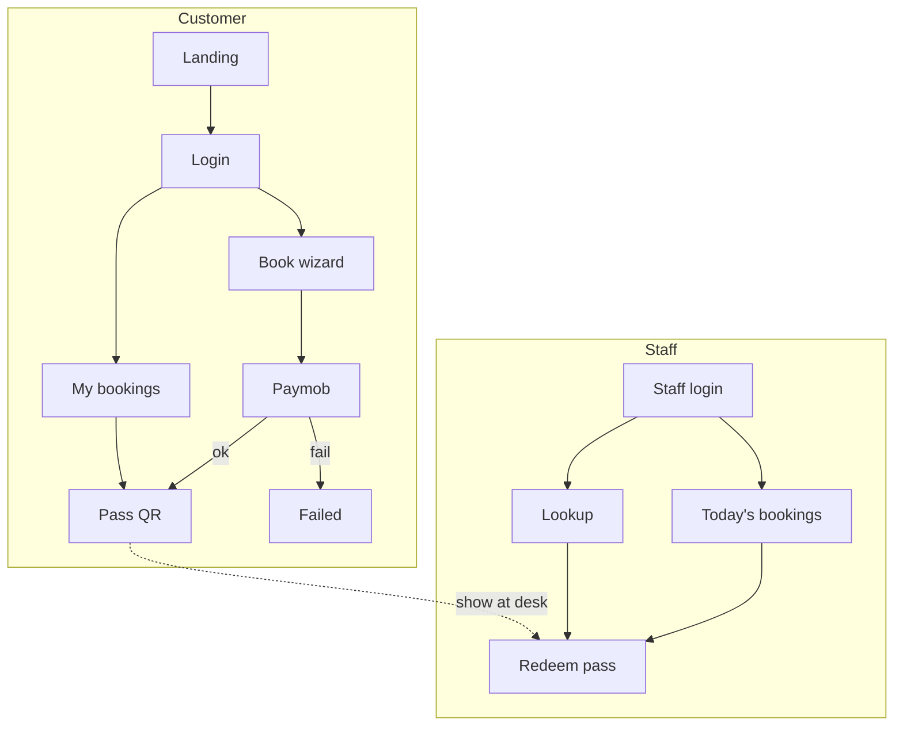

# CourtPass — Stitch screen matrix

Full design coverage for user-flow review: **15 pages × 4 variants = 60 screens**.

| Dimension | Values |
|-----------|--------|
| **Audience** | Customer (booker) · Staff (admin) |
| **Device** | Mobile (390px) · Desktop (1440px) |
| **Theme** | Light · Dark |

Open project: [CourtPass Mahgooz on Stitch](https://stitch.withgoogle.com) · ID `7191702240633724843`

---

## Customer flow (booker)

| Page | Route | Stitch labels |
|------|-------|---------------|
| Landing | `/` | `landing-{mobile\|desktop}-{light\|dark}` |
| Login | `/login` | `login-*` |
| Register | `/register` | `register-*` |
| Book — date | `/book` step 1 | `book-date-*` |
| Book — court | `/book` step 2 | `book-court-*` |
| Book — slots | `/book` step 3 | `book-slots-*` |
| Book — confirm | `/book` step 4 | `book-confirm-*` |
| Payment pending | `/book/pending` | `pending-*` |
| Payment failed | `/book/failed` | `failed-*` |
| My bookings | `/bookings` | `bookings-*` |
| Booking pass | `/pass/{code}` | `pass-*` |

---

## Staff flow (admin)

| Page | Route | Stitch labels | Notes |
|------|-------|---------------|-------|
| Staff PIN login | `/staff/login` | `staff-login-*` | 4-digit gate |
| **Today's bookings** | `/staff/bookings` | `staff-bookings-*` | **Admin list — who's coming** |
| Lookup | `/staff` | `staff-lookup-*` | Search by code / QR |
| Redeem pass | `/staff/pass/{code}` | `staff-redeem-*` | One-tap check-in |

---

## User flow diagram



---

## Generation

```bash
bash scripts/stitch-generate-matrix.sh
tail -f docs/stitch/generation.log
```

Progress tracked in `docs/stitch/manifest.json` (safe to re-run).

Prompts: `docs/stitch/prompts.json`

**Estimate:** ~1–2 min per screen → **~2 hours** for full matrix.

---

*See also: [README.md](./README.md) · [pages-and-ui-design.md](../pages-and-ui-design.md)*
